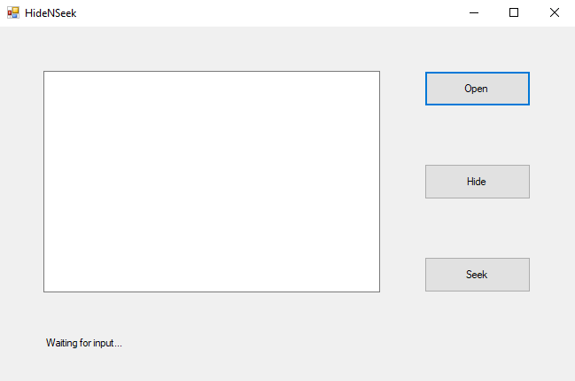

# HideNSeek

A steganography tool to hide messages in an image

## Table of Contents
- [Motivation](#motivation)
- [Install](#install)
- [Usage](#usage)
- [Maintainers](#maintainers)
- [Contributing](#contributing)
- [License](#license)

## Motivation

It is always difficult to transmit messages in an unsecure environment. Some suggest using Encryption while some say steganography. This application is a common type of steganographic skill which allow the user to embed a piece of message into an image. When receiving the image, another user can extract the message back.

To enhance the confidentiality, this tool combines steganography and encryption. A user can insert a key and the tool will encrypt the message before inserting the message into the targeted image.

## Install

Git Clone this project, you should be able to find an exe file in the HideNSeek\bin\Debug folder

Open it and you should be able to see the following interface:

## Usage

1. Click the Open button
2. Select the image you wish to process (Noted that the tool currently only supports **jpg** and **png** file)

For Senders:

3. Enter the desired content into the text box
4. Click the button **Hide**
5. Send the new image to the receiver(s)

For Receivers:

3. Click the button **Seek**
4. Type the key to decrypt the ciphertext extracted (Ignore this step if encryption is not implemented)
5. The hidden message will be extracted and displayed at the text box

**1. Default mode:**

In default mode, no encryption will be implemented.

**2. Encryption mode:**

To enable encryption mode, the senders have to type in the key in addition to the message following this syntax:

> Insertion:
>
> \<KEY>key\<ENDKEY>the message you hope to pass
>
> ie. \<KEY>EncryptionIsFun\<ENDKEY>pls hide this message for me
>
>
>
> Extraction:
>
> \<KEY>key\<ENDKEY>
>
> ie. \<KEY>EncryptionIsFun\<ENDKEY>

**3. Index mode:**

In this mode, users can define the starting pixel and the increment of each operation

>  Insertion:
>
> \<IDX>x,y,increment x, increment y<ENDIDX>the message you hope to pass
>
> ie. \<IDX>18,24,7,4\<ENDIDX>pls hide this message for me
>
>
>
> Extraction:
>
> \<IDX>x,y,increment x, increment y\<ENDIDX>
>
> ie. \<IDX>18,24,7,4\<ENDIDX>

## Maintainers

[@ElderHorse](https://github.com/kcwong395)

## Contributing
Feel free to open an issue if you hope to propose anything

## License
MIT © 2019 ElderHorse
